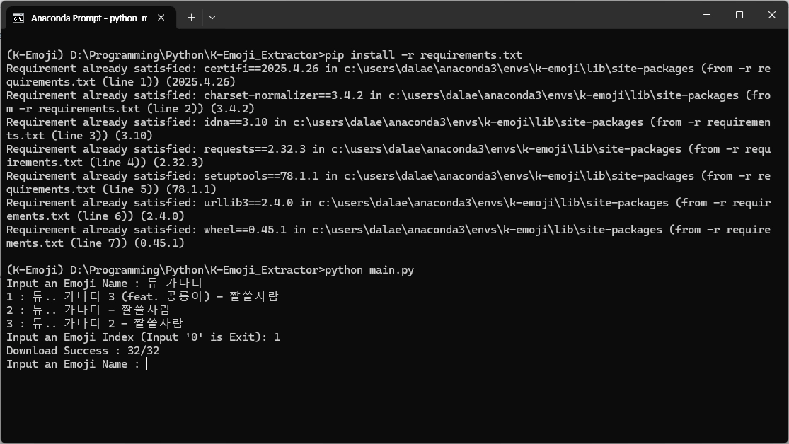

# K-Emoji_Extractor
[Kakaotalk Emoji](https://e.kakao.com/) Extractor

# Requirement
* Python3.13

# License
BSD 3-Clause License

# How to Use
1. Install pip requirements first
```bash
pip install -r requirements.txt
```
2. Run **main.py**
```bash
python main.py
```
3. Input the name of the emoji you want to find

4. Check your results


# Contributor
Thanks to [@stellar-halo](https://github.com/stellar-halo)
